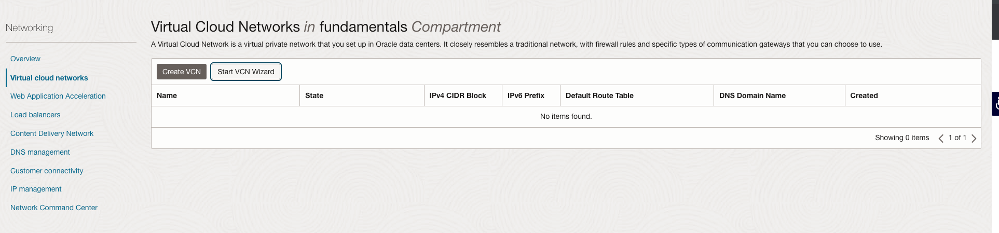
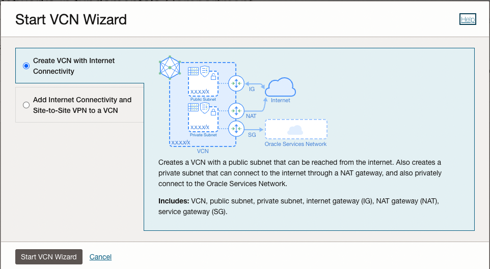
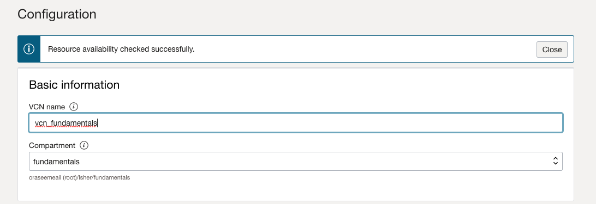
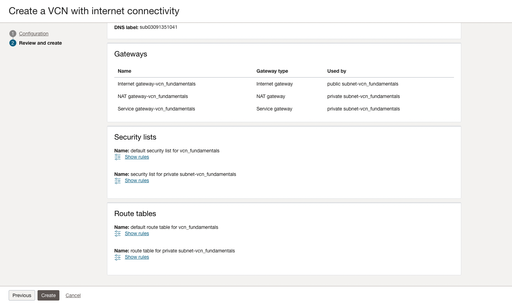
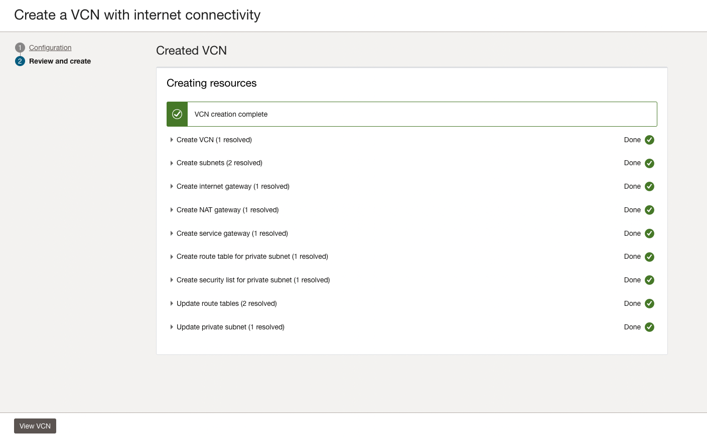
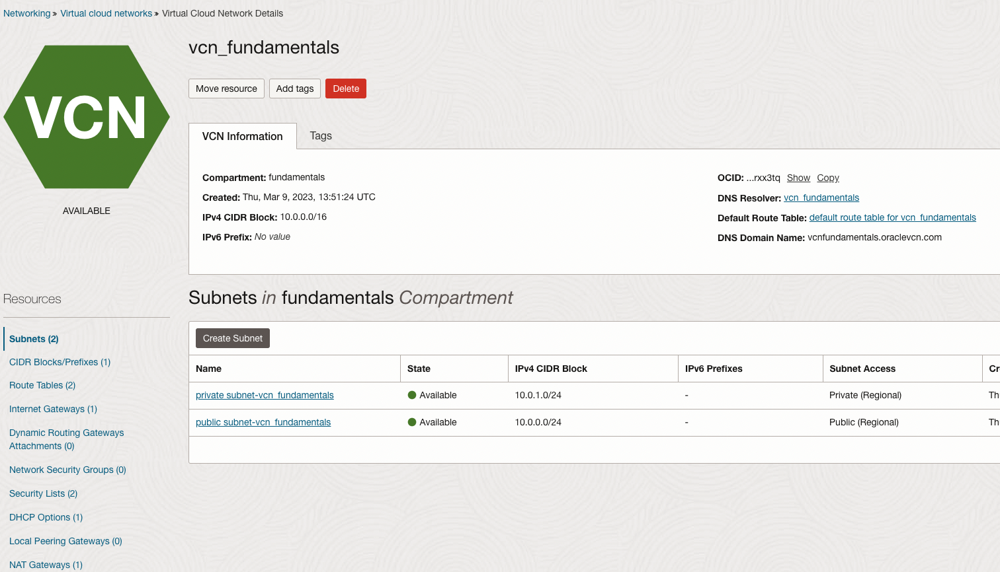
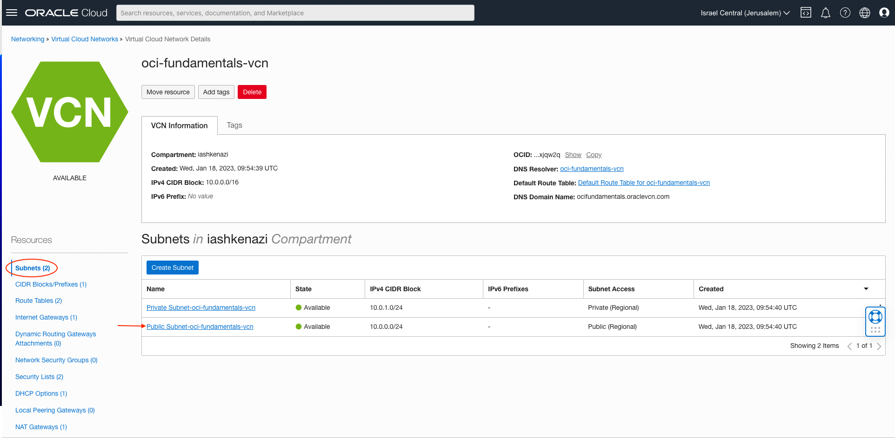
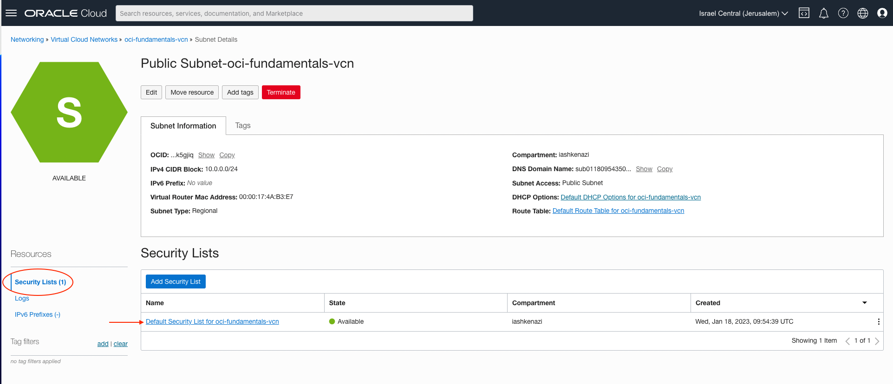
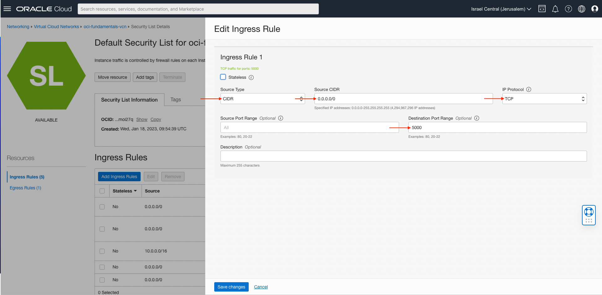

# Creating VCN

1.  Open the navigation menu and click **Networking** &rarr; **Virtual Cloud Networks**
    

2.  Click on **Start VCN Wizard**

    

3.  Click on **Start VCN Wizard**

    

4.  Fill the name of the VCN and leave everything else as default

    

5.  Scroll-down and click on **Create**

    

6.  Click on **View VCN**

    

7.  Under Resources, select **Subnets** and click **Public Subnet-<your_vcn_name>**

         

    3. Under Resources, select **Security Lists** and click **Default Security List for <your_vcn_name>**

       

    4. Click on **Add Ingress Rules**

    5. Enter the following:

       1. **Source Type:** Select CIDR
       2. **Source CIDR:** Enter 0.0.0.0/0
       3. **IP Protocol:** Select TCP
       4. **Destination Port Range:** Enter 3001,3003
       5. Click **Save Changes**

       

8.  Enter the following:

    1.  **Source Type:** Select CIDR
    2.  **Source CIDR:** Enter 10.0.0.0/16
    3.  **IP Protocol:** Select TCP
    4.  **Destination Port Range:** Enter 3306
    5.  Click **Save Changes**

    
