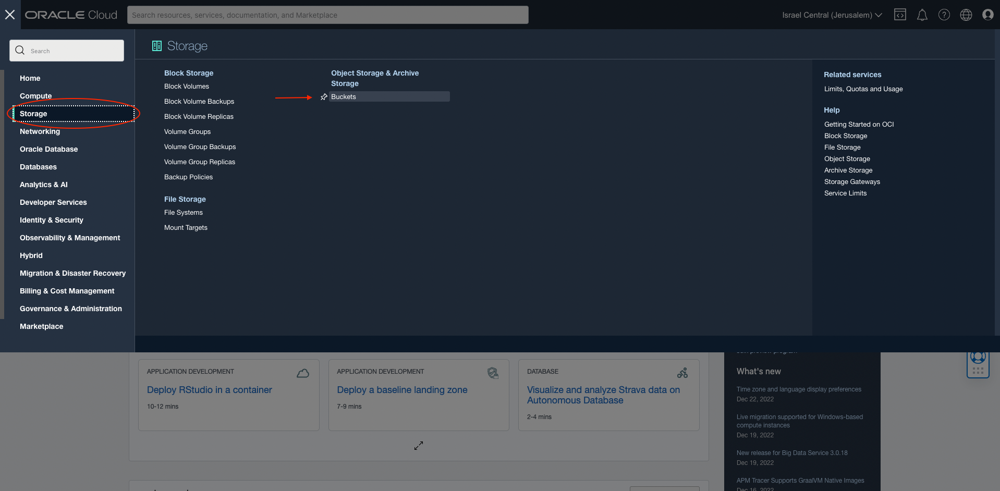
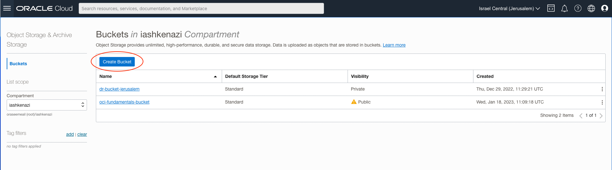
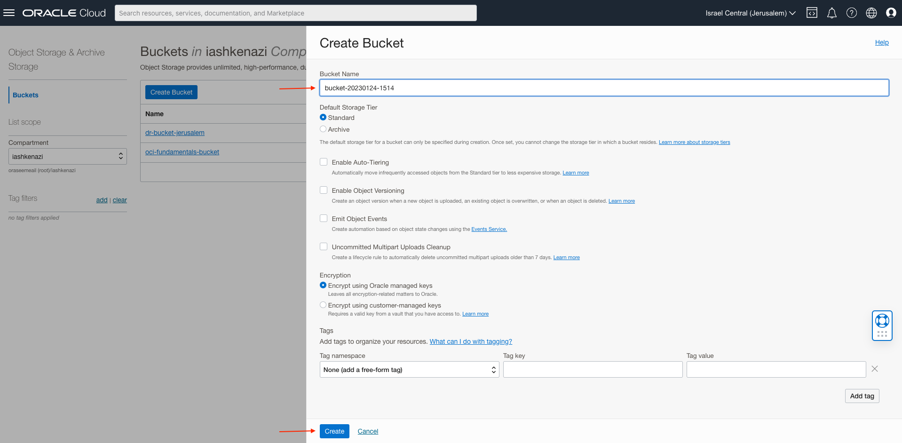
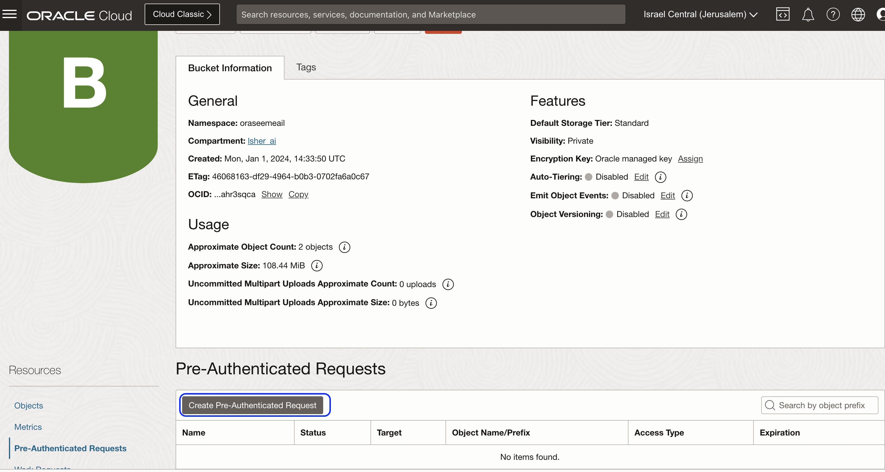
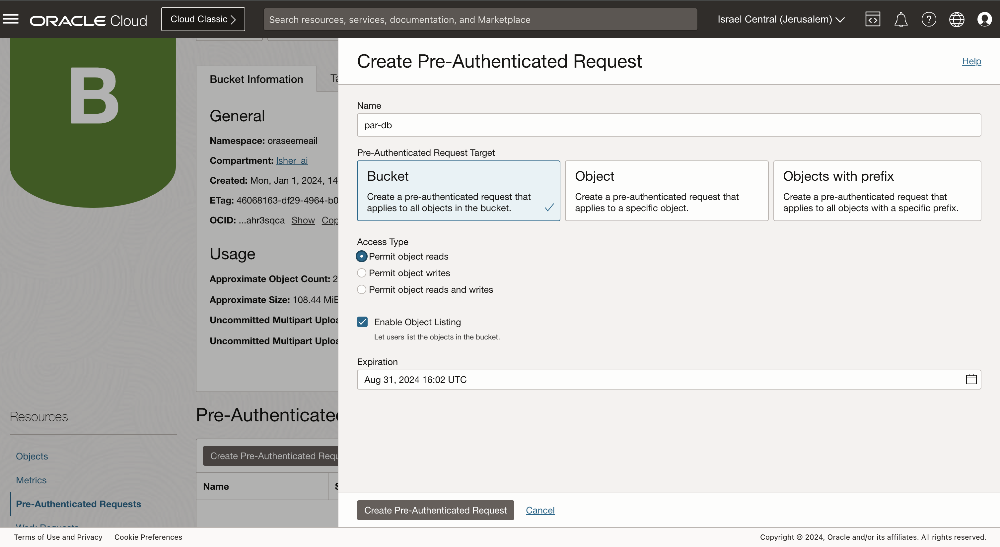
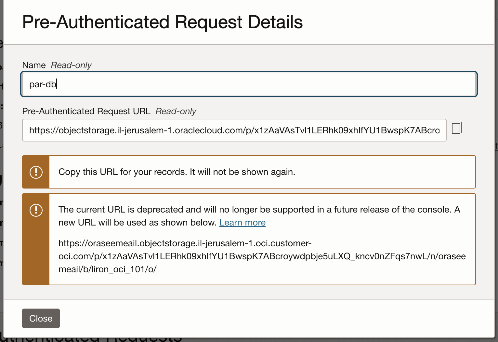
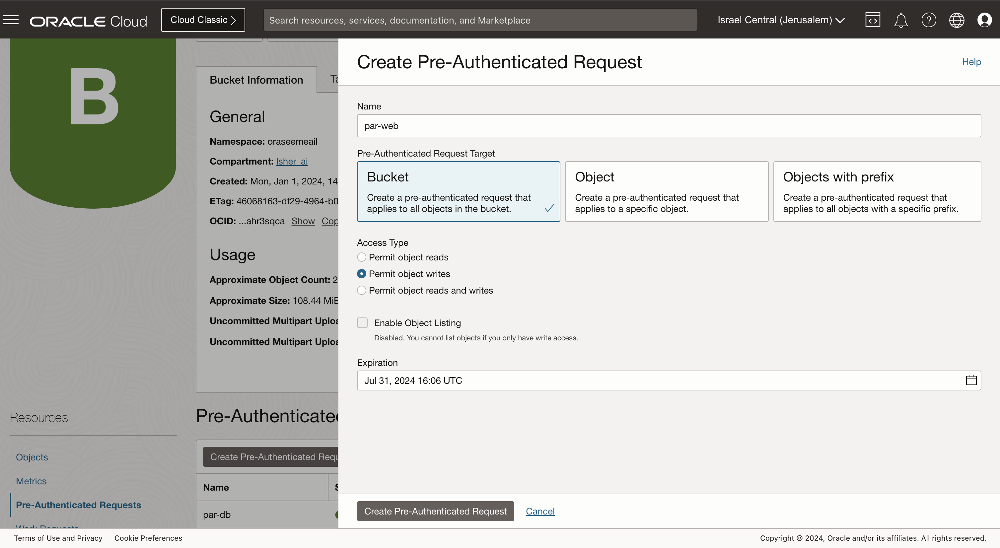
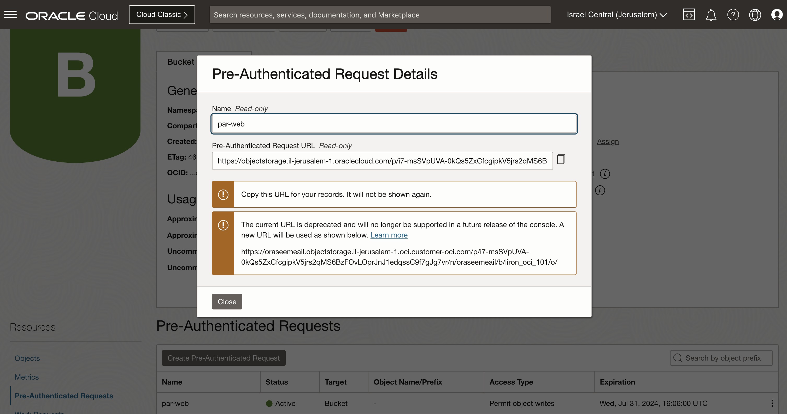

# Creating Bucket and PARs

1. Click **Storage** &rarr; **Object Storage & Archive Storage** &rarr; **Buckets**

   

1. Click **Create Bucket** (make sure you're in the right compartment)

   

1. Enter a name for your bucket and click **Create**

   

1. Click on **Pre-Authenticated Requests** on the left and then click on **Create Pre-Authenticated Request**.

   

1. Fill the name: par-db, select **Bucket**, select **Permit Object reads** and tick **Enable Object Listing**. give it Expiration of more than 30 days. Click **Create Pre-Authenticated Request** button at the bottom.
   

1. copy the par-db URL and save it on the side for later use
   

1. Click again on **Pre-Authenticated Requests** on the left and then click on **Create Pre-Authenticated Request**.

   

1. Fill the name: par-web, select **Bucket**, select **Permit Object writes**. give it Expiration of more than 30 days. Click "Create Pre-Authenticated Request" button at the bottom.
   

1. copy the par-web url and save it on the side for later use
   
