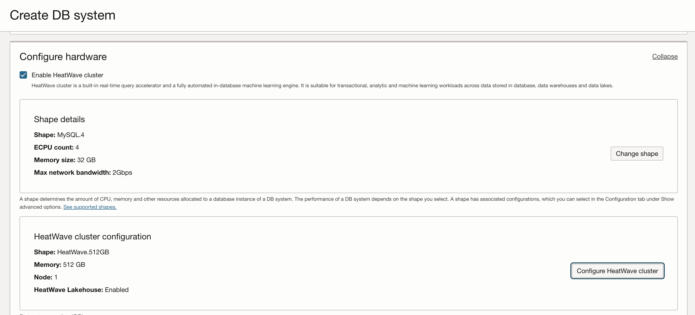
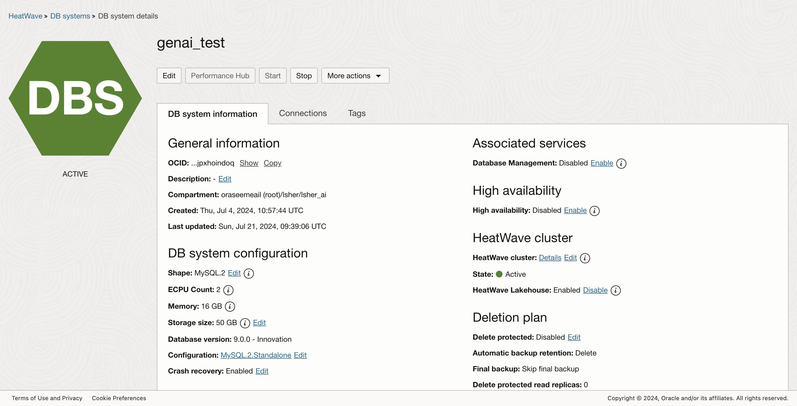

# Heatwave DB Instance

In this step we will create an instance of HeatWave cluster of MySQL4 Shape with HeatWave 512 Lakehouse enabled.

make sure to write down on the side the: private_ip, username, password

1. Click **Databases** &rarr; **Heatwave** &rarr; **DB Systems**

   

1. Click **Create DB System**

   

1. Select **Development or testing** and give it the name **my_prv_gen_ai**

   

1. Enter **Username** and **Password** (don't use @ in the password). save it in a a safe place. (Leave **Standalone**)

   

1. Select your **VCN** and the **PUBLIC** subnet

   

1. Make sure **Enable Heatwave Cluster** is ticked and click on **Change Shape**

   

1. Select **MySQL.4** is ticked and click on **Select a shape**

   

1. click on **Change HeatWave Shape**

   

1. click on **Change shape**

   

1. Select **HeatWave.512GB** is ticked and click on **Select a shape**

   

1. Tick on **HeatWave Lakehouse** and **Save Changes**

   

1. Make sure it's the same config like here.

   

1. Tick off the **Enable automatic backups**

   

1. Click on **Show advanced options**, go to **Configurations** tab

   

1. Select **Database version** - 9.0.0 - Innovation

   

1. Click **Create** to start the creation of the db

1. Wait for the provisioning to complete

   

1. Scroll down and click on **EndPoints** on the left.

   

1. Copy the **Address** (private IP address)

   
