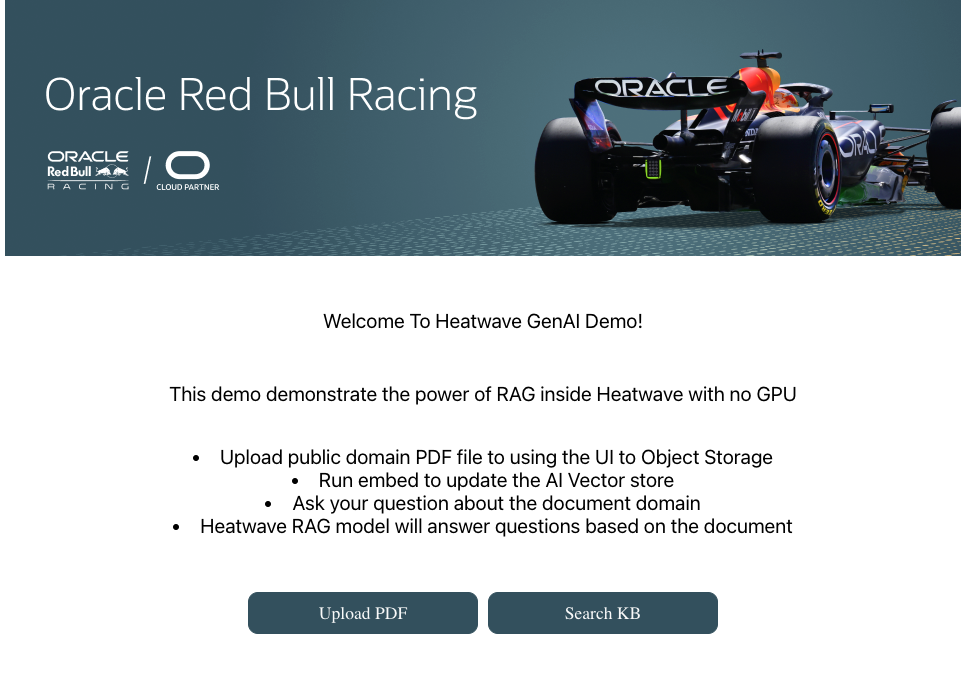
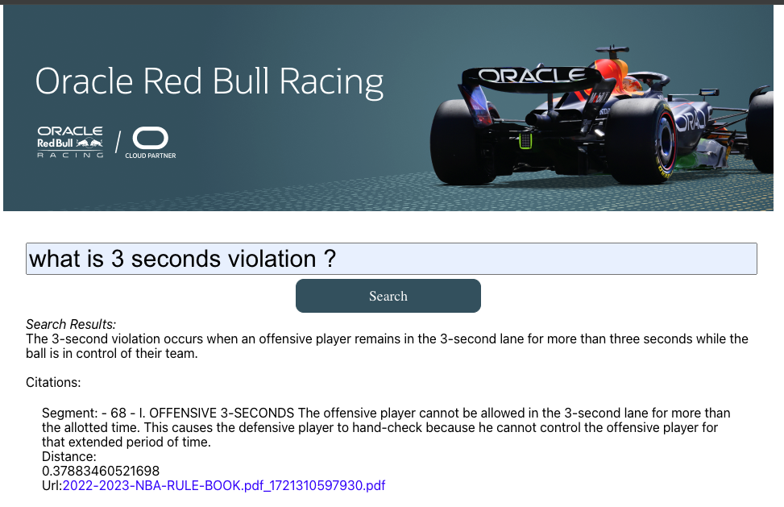

# Welcome to Heatwave Gen AI Demo

## !!! Work in progress !!!

Oracle HeatWave GenAI provides integrated and automated generative AI with in-database large language models (LLMs); an automated, in-database vector store; scale-out vector processing; and the ability to have contextual conversations in natural language—letting you take advantage of generative AI without AI expertise or data movement.

To learn more about HeatWave - [Technical Brief](https://www.oracle.com/a/ocom/docs/heatwave-genai-technical-brief.pdf)

This repository contains a demo showcasing its RAG feature based on the [Getting Started PDF](https://downloads.mysql.com/docs/heatwave-gen-ai-getting-started.en.pdf)

By following this demo, you will be able to create a working RAG in less than an hour.

With the deployed web app, you can upload PDFs to a bucket, run embeddings to create vectors from the PDFs, and ask questions about this database.



for example, in this screen shot i've embedded NBA rules and ask about them.



This demo is using mistral-7b-instruct-v1 modal running inside Heatwave Cluster.

\***\* This demo is provided as-is and should be used in a test environment (separate VCN) with no access to the production environment or proprietary data. \*\***

[Learn here more about HeatWave](https://www.oracle.com/uk/heatwave/genai/)

- **Prerequisites:**
  1. OCI Account [(Click here to SignUp)](https://www.oracle.com/il-en/cloud/free/) / [(Click Here to Login)](https://www.oracle.com/cloud/sign-in.html)
  2. VCN [(Click here to learn how to create)](/VCN.MD)
  3. Compute Instance [(Click here learn how to create )](/compute.md)
  4. Heatwave DB Instance [(Click here learn how to create )](/heatwave.md)
  5. Object storage bucket with PAR. [(Click here learn how to create)](/bucket.md)

# steps:

1.  Make sure your ssh key is secured [(Windows users)](https://docs.oracle.com/en-us/iaas/Content/Compute/Tasks/connect-to-linux-instance.htm#linux-from-windows-openssh)

            chmod 700  <your_ssh_key_path>.key

1.  Connect to the compute instance you created earlier today by running the following command on your shell:

            sudo ssh  -i <your_ssh_key_path>.key opc@<instance_ip>

1.  After you connect to your machine, install git by running the following command:

            sudo dnf install git -y

- If you are using Ubuntu, please use **APT** package manager
  ```bash
  sudo apt install git -y
  ```

1.  Install nvm

            curl -o- https://raw.githubusercontent.com/nvm-sh/nvm/v0.39.7/install.sh | bash

1.  Disconnect from the server and connect again

            exit
            ssh -a ...

1.  Install node lTS

            nvm install --lts

1.  Make sure Node is installed

            node -v

            result --> v20.15.1

1.  Install yarn and pm2

            npm install -g pm2 yarn

1.  Clone this project

            git clone https://github.com/OCI-IL/HeatwaveGenAIDemo.git

1.  Change to the directory

            cd HeatwaveGenAIDemo

1.  Run yarn to install all deps.

            yarn

1.  Change dir to src

            cd src

1.  Run the create_env scripts. The scripts will ask you for the params of the DB and the PARs for the DB and the frontend and will create .env files

            ./create_env.sh

1.  Return to root folder
    $ cd ..

1.  Run the app using pm2

            pm2 start ecosystem.config.js

1.  Save the config of pm2

            pm2 save

1.  Set pm2 to run on startup

            pm2 startup systemd

1.  The pm2 startup systemd command will generate a command you must run with sudo. It usually looks like this:

            sudo env PATH=$PATH:/home/opc/.nvm/versions/node/v20.15.1/bin /home/opc/.nvm/versions/node/v20.15.1/lib/node_modules/pm2/bin/pm2 startup systemd -u opc --hp /home/opc

1.  Run the output cmd by copy-paste

1.  try to access the server locally

            curl http://localhost:3003/createDb
              ->> you should see good result
            curl http://localhost:3001/
              ->> you should see html

1.  open the local Oracle Linux firewall:

            sudo firewall-cmd --zone=public --permanent --add-port=3003/tcp
            sudo firewall-cmd --zone=public --permanent --add-port=3001/tcp

1.  commit the rules

            sudo firewall-cmd --reload

    - If you are using Ubuntu, please follow this cheat sheet:https://bit.ly/OCI_OS_FW
      ```bash
      sudo iptables -I INPUT 6 -m state --state NEW -p tcp --dport 3003 -j ACCEPT
      sudo iptables -I INPUT 6 -m state --state NEW -p tcp --dport 3001 -j ACCEPT
      sudo netfilter-persistent save
      ```

1.  Go back to Chrome and navigate to: http://{public_instance_ip}:3001

1.  Upload a PDF file, run embed, and enjoy exploring.

1.  With the trial account, this setup can run for 30 days until credits expire. Please turn off the resources if you are not using them.
